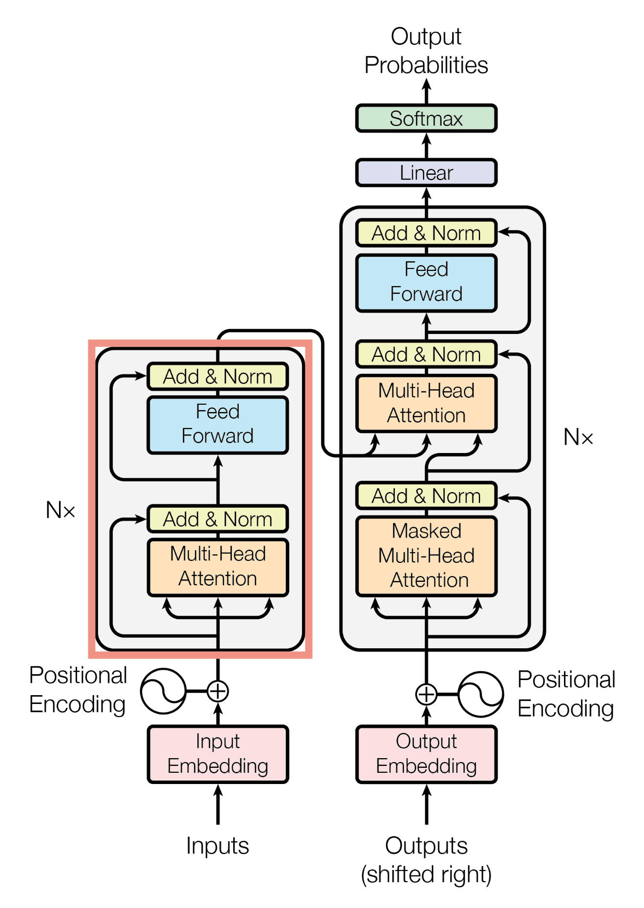
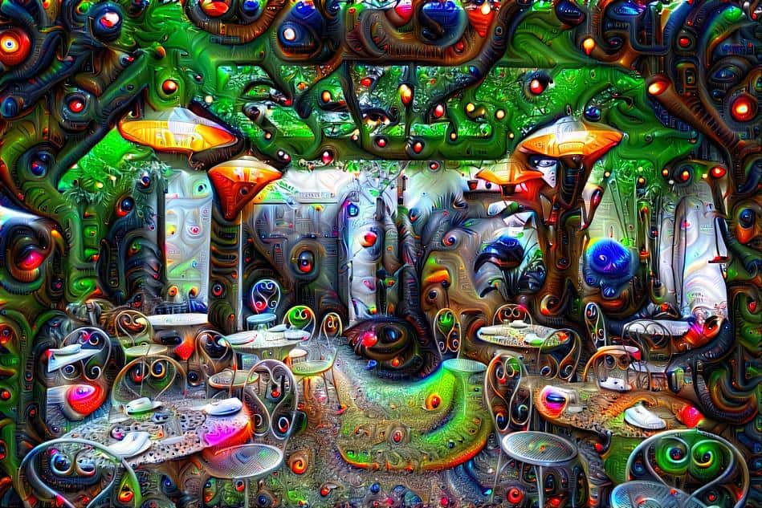

## University of Montréal: BSc in Physics and Computer Science (2021 - 2023)

**Key Courses:**
- Introduction to Machine Learning (A)
- Algorithms and Data Structures (A)
- Python Programming (A)
- Java Programming (A)

[Program Description](...)

##  University of Montréal: MSc in Machine Learning (2023 - 2025) 

**Key Courses:**
- Probabilistic Graphical Models (A)
- Natural Language Processing with Deep Learning (A)
- Representation Learning (A)

To give a clearer picture of my work during my master's, here’s a brief overview of my course projects:

###  Probabilistic Graphical Models 

**Description:**  
This course introduces the statistical modeling of multidimensional data using probabilistic graphical models, focusing on learning and inference algorithms.

**Final Project:**  
We enhanced Hidden Markov Models (HMMs) by using **Hierarchical Hidden Markov Chains (HHMM)**, a multi-layer architecture that captures more complex patterns. We constructed a recursive structure allowing high parallelization, resulting in significantly better performance, as shown in the graph below.

[View the Project](...)

###  Natural Language Treatment 

**Description:**  
Natural Language Processing (NLP) focuses on the interaction between computers and humans using natural language. This course covers both fundamental and cutting-edge NLP techniques, emphasizing Deep Learning.

**Final Project:**  
We developed a **multi-agent debate framework** where multiple large language models (LLMs) debate to answer questions. This approach reduces hallucinations by leveraging the consensus among different models and debate rounds.

[Final Project Report](...)

###  Representation Learning 

**Description:**  
This course delves into deep learning, covering neural networks, convolutional networks, LSTMs, attention mechanisms, and modern generative models like **Generative Adversarial Networks (GANs)** and **Variational Autoencoders (VAEs)**.

